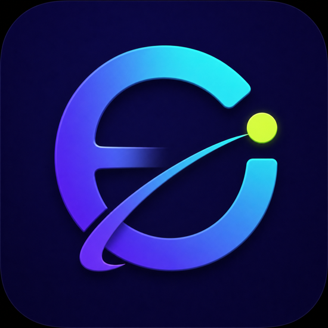

<p align="center">
  
</p>

<h1 align="center">DHQClash</h1>

<p align="center">
  Кроссплатформенное приложение для управления сетевыми конфигурациями на базе
  <a href="https://github.com/MetaCubeX/mihomo">mihomo</a>.
</p>

<p align="center">
  <a href="https://github.com/dashqee/DHQ-Clash/releases/latest"></a>
  <a href="https://github.com/dashqee/DHQ-Clash/releases"></a>
  <a href="LICENSE"></a>
  <a href="https://t.me/dhqclashconfigbot"></a>
</p>

DHQClash работает на Android, Windows и macOS, поддерживает конфигурации по URL,
из файла и QR-кода, автоматически обновляет профили и показывает состояние
подключения в одном интерфейсе.

[//]: # (`<p align="center">)

[//]: # (  )

[//]: # (</p>`)

## Возможности

- единый интерфейс для Android, Windows и macOS;
- добавление профиля по ссылке, из локального файла или QR-кода;
- выбор активного профиля и нужной группы прямо в приложении;
- ручное и автоматическое обновление URL-профилей;
- системный режим, TUN, DNS и дополнительные параметры mihomo;
- статистика трафика, список подключений и журнал работы;
- светлая и тёмная темы, адаптивный интерфейс Material 3;
- резервное копирование настроек и синхронизация через WebDAV;
- встроенная проверка новых версий приложения.

## Установка

Скачивайте приложение с официальной
[страницы загрузки](https://dhqclash.app/#downloads). Резервный источник —
[GitHub Releases](https://github.com/dashqee/DHQ-Clash/releases/latest).

| Платформа | Какой файл выбрать |
| --- | --- |
| Android | `android-arm64-v8a.apk` для большинства современных устройств; `armeabi-v7a.apk` для старых 32-битных устройств; `x86_64.apk` для совместимых эмуляторов |
| Windows | `windows-amd64-setup.exe` для обычной установки или `windows-amd64.zip` для переносной версии |
| macOS на Apple Silicon | `macos-arm64.dmg` для Mac с процессором M1 и новее |
| macOS на Intel | `macos-amd64.dmg` |

Имена файлов содержат номер версии, например
`DHQClash-1.1.2-windows-amd64-setup.exe`.

### Android

1. Скачайте подходящий APK.
2. Откройте файл и подтвердите установку из выбранного источника.
3. При первом подключении разрешите приложению создать VPN-подключение.

### Windows

1. Запустите `windows-amd64-setup.exe` и завершите установку.
2. Откройте DHQClash из меню «Пуск».
3. Если для выбранного режима потребуются дополнительные права, приложение
   запросит их при включении.

### macOS

1. Откройте DMG для своей архитектуры.
2. Перетащите DHQClash в папку Applications.
3. Если macOS остановит первый запуск, убедитесь, что файл скачан из официального
   релиза, затем разрешите его в «Системные настройки → Конфиденциальность и
   безопасность».

## Быстрый старт

1. Получите конфигурацию у своего поставщика или через
   [Telegram-бот DHQClash](https://t.me/dhqclashconfigbot).
2. Откройте раздел **Профили** и нажмите **Добавить профиль**.
3. Выберите удобный способ:
   - **URL** — вставьте ссылку на профиль;
   - **Файл** — выберите сохранённый файл конфигурации;
   - **QR-код** — отсканируйте код камерой на мобильном устройстве или выберите
     изображение на компьютере.
4. Нажмите на добавленную карточку, чтобы сделать профиль активным.
5. Вернитесь на главный экран и нажмите кнопку запуска.
6. Подтвердите системный запрос, если операционная система его покажет.

После запуска текущая скорость, объём трафика и состояние подключения появятся
на главном экране. Выбор направления для отдельных групп доступен в разделе
**Прокси**.

## Профили и обновления

- Чтобы обновить все URL-профили, откройте **Профили** и нажмите значок
  синхронизации в верхней части экрана.
- Чтобы обновить один профиль, откройте меню `⋮` на его карточке и выберите
  **Синхронизировать**.
- Автоматическое обновление и его интервал настраиваются при редактировании
  URL-профиля.
- Начиная с версии 1.0.8 номер настольного приложения всегда виден внизу левого
  сайдбара. Кнопка рядом с ним запускает ручную проверку обновления.
- Автоматическую проверку новых версий можно включить в настройках приложения.

## Если что-то не работает

### Профиль добавлен, но подключения нет

Убедитесь, что карточка профиля выбрана, системное разрешение выдано, а срок
действия конфигурации не закончился. Затем синхронизируйте профиль и перезапустите
подключение.

### URL-профиль не обновляется

Проверьте ссылку в меню редактирования профиля и попробуйте открыть её в обычном
браузере. Если ссылка недоступна или сервер возвращает ошибку, обратитесь к тому,
кто выдал конфигурацию.

### После изменения настроек пропала сеть

Остановите подключение, верните последние изменённые параметры и запустите его
снова. Для диагностики откройте **Инструменты → Журналы**. Если проблема
сохраняется, перезапустите приложение.

### Где получить помощь

Конфигурация и доступные действия находятся в
[Telegram-боте DHQClash](https://t.me/dhqclashconfigbot). Техническую проблему
можно описать в [GitHub Issues](https://github.com/dashqee/DHQ-Clash/issues),
указав платформу, версию приложения и точный текст ошибки. Не публикуйте ссылки
на личные конфигурации, токены и другие секреты.

## Безопасность

Конфигурация определяет обработку сетевых подключений внутри приложения.
Добавляйте только те ссылки, файлы и QR-коды, источнику которых доверяете.
Перед передачей журналов удаляйте из них адреса профилей, токены и персональные
данные. Контрольные суммы официальных файлов публикуются в каждом релизе в
`SHA256SUMS`.

## Сборка из исходного кода

Понадобятся Flutter, Go и платформенные инструменты для целевой ОС.

```bash
git clone --recurse-submodules https://github.com/dashqee/DHQ-Clash.git
cd DHQ-Clash
flutter pub get
flutter test
dart setup.dart android   # или windows, macos, linux
```

Если репозиторий уже клонирован без подмодулей:

```bash
git submodule update --init --recursive
```

Перед отправкой изменений рекомендуется выполнить проверки, используемые в CI:

```bash
flutter analyze --no-fatal-infos
flutter test --reporter expanded
```

Подробные команды и правила разработки находятся в
[`AGENTS.md`](AGENTS.md) и каталоге [`.agents/`](.agents/).

## Проект и лицензия

- приложение: [dashqee/DHQ-Clash](https://github.com/dashqee/DHQ-Clash);
- ядро: [MetaCubeX/mihomo](https://github.com/MetaCubeX/mihomo);
- основа проекта: [chen08209/FlClash](https://github.com/chen08209/FlClash).

Исходный код распространяется по лицензии [GNU GPL v3](LICENSE).
